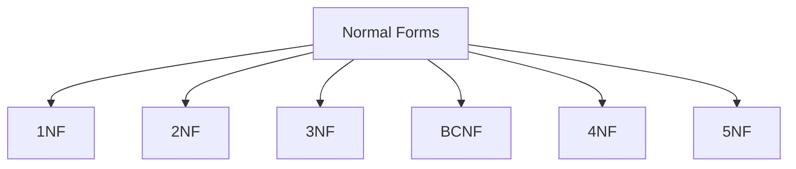

# Normalization
- Normalization is a database design technique that reduces data redundancy and eliminates undesirable characteristics like Insertion, Update and Deletion Anomalies.
- Normalization rules divides larger tables into smaller tables and links them using relationships.
- The purpose of Normalization in SQL is to eliminate redundant (repetitive) data and ensure data is stored logically

## Advantages of Normalization
Following are some of the advantages of normalization:
- To reduce the redundancy from the table.
- To save the memory space as data can be stored in compact form.
- To remove Insert, Update and Delete anomalies.
- Normalization minimizes the null values.
- Using normalization, we can simple the queries.
- It is important for OLTP (Online Transaction Processing). However Denormalization supports OLAP (Online Analytical Processing).
- It simplifies the database structure.
- Searching, sorting and creating indexes will be faster after applying the normalization.

# Duplicacy
1. Row-level: Rows are duplicate
2. Column-level: column or data entery are duplicate

# Anomolies
- Insertion Anomaly:
----
An Insert Anomaly occurs when certain attributes cannot be inserted into the database without the presence of other attributes.

- Update or Modification Anomaly:
----
An update anomaly is a data inconsistency that results from data redundancy and a partial update.

- Deletion Anomaly:
----
A deletion anomaly occurs when you delete a record that may contain attributes that shouldn't be deleted.

First Normal Form (1NF)
----
- A relation will be in 1NF if each attribute in the relation contains an atomic value.
- It states that an attribute of a table cannot hold multiple values. It must hold only single-valued attribute.
- First normal form disallows the multi-valued attribute, composite attribute, and their combinations.
- A column should contain values of the same domain.
- Each column should contain unique column name.
- It states that an attribute of a table cannot hold multiple values. It must hold only single-valued attribute.
- First normal form disallows the multi-valued attribute, composite attribute, and their combinations.
- No ordering of rows and columns.
- ER-Diagram conversion to table is always in 1NF
- One way: create separate rows for each multivalued attributes
- Another way: Split the table such that a multivalued attribute is contained in a different table

Second Normal Form (2NF)
---
- A relation will be in 2NF if:
- It is in 1NF.
- No partial dependency is there in the relation.
    Partial dependency means: Proper subset of Candidate key determines non prime attribute.

Third Normal Form (3NF)
---
- A relation will be in 3NF if:
- It is in 2NF.
- No transitive dependency is there in the relation for non prime attributes.
    Transitive dependency means: Non prime attribute determines non prime attribute.
- A 3NF eliminates all anomalies.
- It is consider as an adequate normal forma

Boyce Codd Normal Form (BCNF)
---
- BCNF is a stricter version of 3NF.
- Developed by Raymond F. Boyce and Edgar F. Codd.
- A relation will be in BCNF if:
- It is in 3NF.
- In every non trivial functional dependency X → Y, X is the super key of the table.
