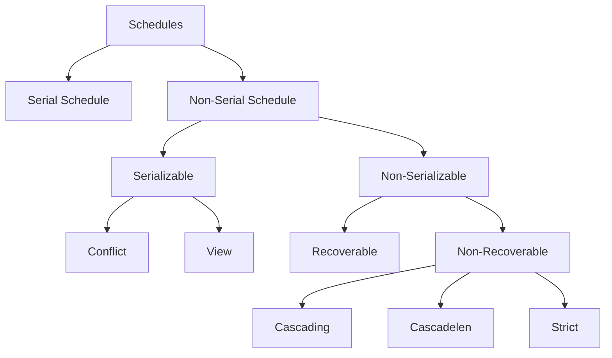

# schedule
- A schedule is defined as an execution sequence of transactions.
- It maintains the order of opeartion in each individual transaction.
- In other words, a schedule is the order in the operations of multiple transaction appear for execution
- Schedule comes into the picture when there are more than one transaction running
- A particular schedule should have the same nnumber of operation as the total number of operations in all transaction added together.
- A schedule should also maintain the order of operations of transaction
- At a time, on one operation can be performed ie no overlapping

## Types of schedule

# Serial schedule
- It is safe, but more time and resource consumption.
- It has no context switching 
- No transaction starts until a running transaction is ended
# Non-serial schedule
- In non-serial there is context switching between transactions operations.
- In this, a transaction will proceed without waiting for the another transaction to complete all its transaction
- Less time consuming, but not safe

## Serializable
- A serializable schedule always leaves the database in consistent state.
- A serial schedule is always a serializable schedule because in serial schedule, a transaction only starts when the other transaction finished execution.
- However a non-serial schedule needs to be checked for Serializability.
- A non-serial schedule is said to be serializable when it is equivalent to a serial schedule for n number of concurrent transaction
- A serial schedule doesn’t allow concurrency, only one transaction executes at a time and the other starts when the already running transaction finished.
- A serializable schedule helps in resource utilization and cpu throughput also guaranteeing consistency.
### Types of Serializability
##### Conflict Serializability
- A schedule is called conflict serializable if we can convert it into a serial schedule after swapping its non-conflicting operations.
- Conflicting operations:
---
Two operations are said to be in conflict, if they satisfy all the following three conditions:
    1. Both the operations should belong to different transactions.
    2. Both the operations are working on same data item.
    3. At least one of the operation is a write operation.

#####  View Serializability
- View Serializability is a process to find out that a given schedule is view serializable or not.
- To check whether a given schedule is view serializable, we need to check whether the given schedule is View Equivalent to its serial schedule.
- A schedule will view serializable if it is view equivalent to a serial schedule.
- View Equivalent
- Two schedules S1 and S2 are said to be view equivalent if they satisfy the following conditions:

1. Initial Read
---
An initial read of both schedules must be the same.
Suppose two schedule S1 and S2.
In schedule S1, if a transaction T1 is reading the data item A, then in S2, transaction T1 should also read A.

2. Update Read
---
If in schedule S1, the transaction T1 is reading a data item updated by T2 then in schedule S2, T1 should read the value after the write operation of T2 on same data item.

3. Final write
---
A final write must be the same between both the schedules.
In schedule S1, if a transaction T1 updates A at last then in S2, final writes operations should also be done by T1.

Note: If a schedule is conflict serializable then it means it is also view serializable.
However if not, then check for blind write. if not then its is not a view serializable
## Non-Serializable
#### Recoverable and Non-recoverable
If each transaction present in the schedule consists only after all the transaction from which it has read the values are commited, then its recoverable.
Or else non-recoverable

Note: Whenever a schedule has no dirty read problem then it means its is recoverable,
Or else check for dirty read commit is only after the transaction it depends also has commited.

#### check recoverable
1. First check if dirty read exist
2. If no then the schedule is recoverable
3. If yes then check if the commit is performed serially just like order of transaction
4. If no then, it is non-recoverable
5. If yes then, recoverable

##### cascading and casccadelen
if there is dirty read it is cascading else cascadelen
##### Strict
if strict criteria is applicable:
    unless any transaction that operates on a particular variable implemented the commit operation no other transaction can operate on that same variable
# Recoverability of Schedule
- Sometimes a transaction may not execute completely due to a software issue, system crash or hardware failure.
- In that case, the failed transaction has to be rollback.
- But some other transaction may also have used value produced by the failed transaction.
- So we also have to rollback those transactions.
